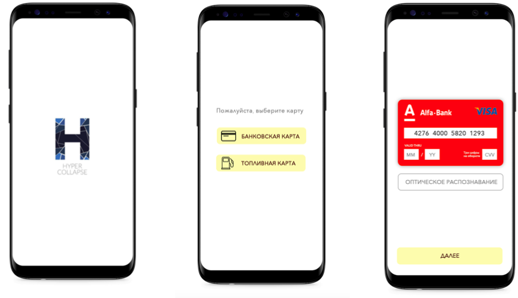

# Hyper Collapse (mobile)

Приложение для просмотра актуального списка блюд в Бауманских столовых и кафе.

> Чихнула Диана

## Что сделано
- Распознование номера карты на клиенте
- Поддерживаются банковские номера больше 16 цифр
- Срок действия карты парсится в различных форматах и приводится к единому
- Держатель карты может быть спарсен и передан серверу
- Подсвечивается логтип системы разработки карт
- Подсвечивается лого банка

 

### Стек технологий:

| Где | Что | Зачем |
| :---: | --- | --- |
| Android/iOS | Xamarin +  Card.io | Кросс платформенное приложение на выходе |
| Сервер | Python + Nginx | Быстро развернули |

### От дизайнера
> Дизайн данного приложения был разработан согласно последним трендам и тенденциям мобильной индустрии. Были выдержаны цветовые нормы, банановый цвет находит отражение в стилистике карт, в том числе и в логотипах банков, теплый оранжевый необходим для поддержания и разнообразия цветовой палитры. Прямоугольные кнопки и поля стали особенно актуальны после выхода новой версии Android9, что также нашло отражение в приложении. 
  Приложение интуитивно понятно пользователю как с точки зрения UI, так и UX, простота использования позволяет мгновенно получать всю необходимую информацию.
  Был создан уникальный дизайн, который содержит элементы Flat и Material, также новый узнаваемый и легко запоминающийся логотип, который отражает суть приложения, создает определенное впечатление и настроение.
  
### От контент-мейкера
> Чтобы сделать качественное и правдоподобное приложение для распознования банковских и топливных карт, я изучила bin коды всех самых популярных Российских банков. Составила базу данных состоящую из 52 банков, их кодов, брендовых цветом и логотипов. 

Best Hack 2019